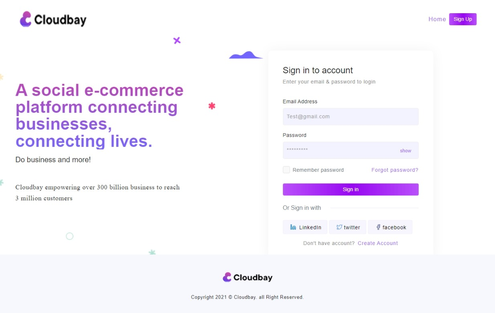

# Cloudbay world
## A social e-commerce platform connecting businesses, connecting lives.

Cloudbay empowering over 300 billion business to reach 3 million customers.

## Cloudbay Development 
this is the official private repo of cloudbay development team.

### Team members (dev)
- [Festus](https://github.com/festgo12).
- [Abbas ](https://github.com/).
- [petec ](https://github.com/).
- [Cyril](https://github.com/).

### To run the project

clone the project to localhost (htdoc)

run composer in project dir (cloudbay/project)
- composer install

copy .env.example to .env
- cp .env.example .env

create a database with name = db_cbay

run migration 
- php artisan migrate

## CODE OF CONDUCT
- comment code as much as possible.
- use Camel casing naming convention. 
- all development is done on the dev branch of the repo (no pushing to main).
- use feature branching when working on new features before merging to dev branch.
- commit codes as much as possible (2-3days atleast).
- seek help if confused of any part of the project.

